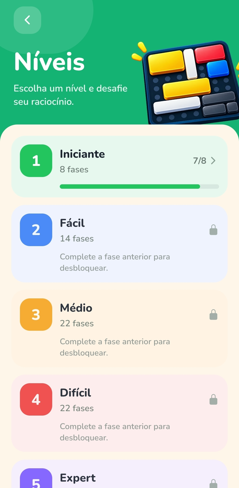
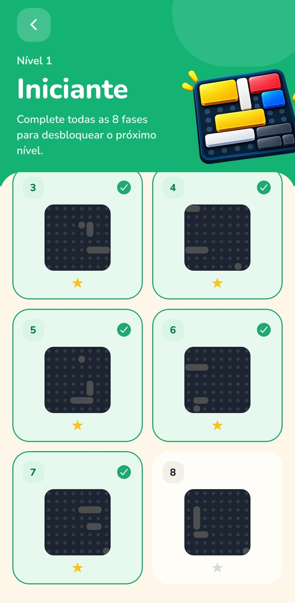
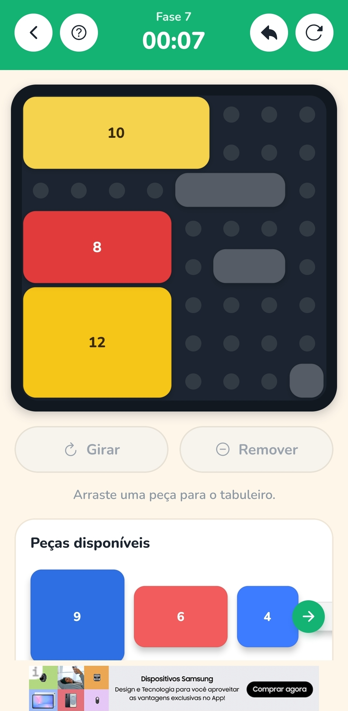
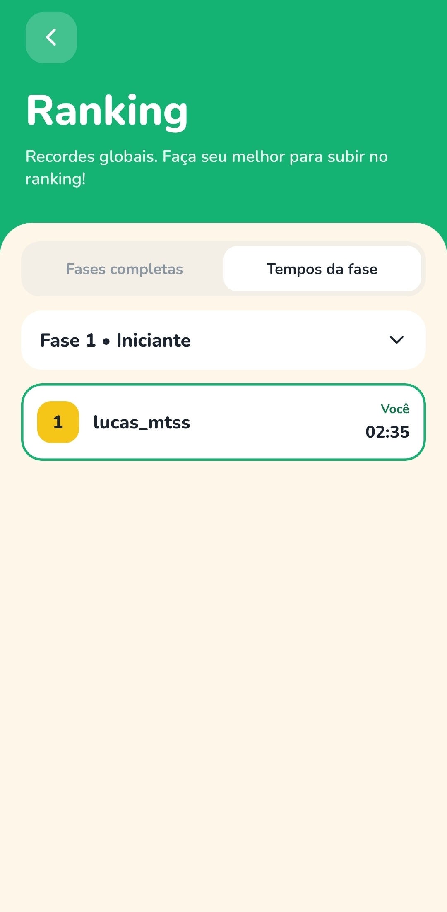
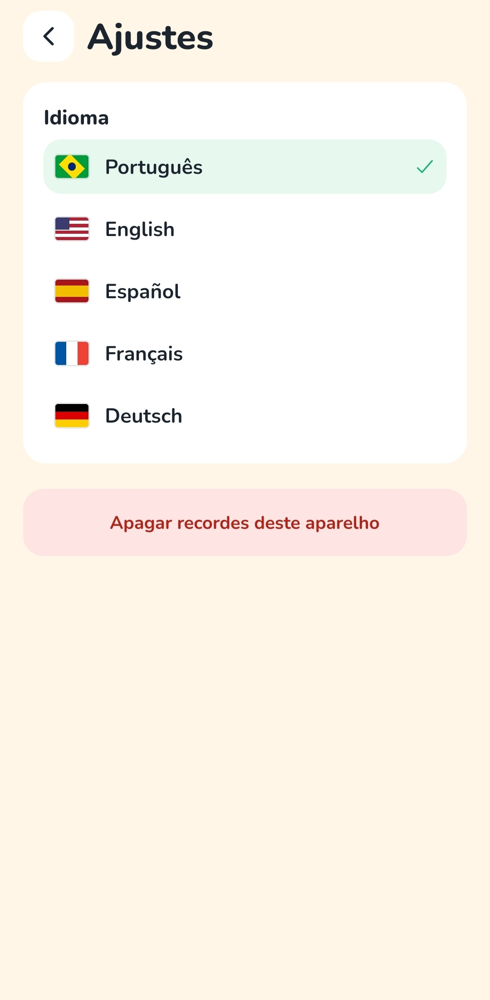

# Logic Jigsaw

Projeto de estudos de desenvolvimento mobile com React Native e Expo. O código existe para aprender arquitetura, navegação, conta na nuvem, anúncios e build. Não é um app publicado nas lojas.

O jogo é um quebra-cabeça de encaixe. O tabuleiro tem 8×8 casas e 88 fases. A pessoa arrasta peças coloridas, guarda o melhor tempo e pode entrar com e-mail para sincronizar o progresso e aparecer num ranking pelo nickname.

## Link do APK instalável

https://expo.dev/accounts/lucas_mtss/projects/logic-jigsaw/builds/dcb0a71e-a23b-4d62-832b-af9f065f0d49

## Screenshots

<p>
  
  
  
  
</p>
<p>
  
  
  
</p>

## Material de estudo

Comece por [docs/minicurso.html](docs/minicurso.html). É um minicurso em um único arquivo: módulos, trechos deste repositório, comandos e dois laboratórios que rodam no navegador. Vai servir como material de apoio para estudar o projeto.

## Rodar por cima

```bash
npm install
npx expo start
```

Conta, anúncios e compra ficam desligados até você preencher um `.env` a partir de `.env.example`. Os ids de anúncio neste repositório são os de teste do Google.
